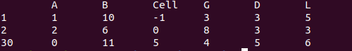
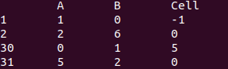
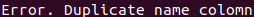

# csv_pars


## Project start
```
make
./csvreader <filename.csv>
```
## Out test 1.csv
<p align="center">

</p>

## Out test file1.csv
<p align="center">

</p>

## Out test file.csv
<p align="center">

</p>
